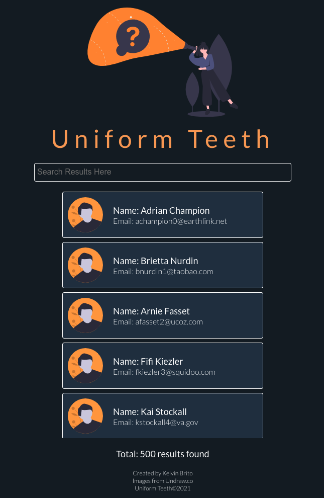

# Take Home Assignment

Thank you so much for the opportunity to make this. I had a alot of fun and hope you enjoy!

# Steps: 
* Run Docker
* Clone this into your local, install dependencies and 'run npm start' to load project.

This project uses:
1. axios for data fetching
2. React-Toast-Notifications to handle notifications upon card clicked
3. React-Window to handle large list data set
4. Sass for styling and structure

There were no third party frameworks for styling purposes. Design was created with pure CSS, using Sass to assist me in structuring my code better and for its added benefits.

# Things to look out for:

This projects handles the following:
* Users can search for names or email and the result will automatically load up as you type. Names is most important if youre typing names. Emails appear if youre typing for emails. Your specific search should match whatever you typed. Even if you type certain portions of an email (lets say the email domain), it will appear.
* Users can click on a person card. Once clicked, users should see a notification slide in saying "{person name} was selected!". You can click as many users as you'd like. 
* The users can scroll through the list of data avaiable. Scrolling area is where the cards fade in.
* React-window does a fantastic job in being able to render out this list in an efficient manner without putting too much stress on the DOM. I wanted this app to be as performant as possible, considering that huge chunks of data can cause slow-downs (experienced them early developing this project) 
* Code organization. I made sure that every component is structured in a way thats easy to find. Left comments to explain certain aspects when necessary,
* Design. This was created on the fly but i wanted to make sure that designs look modern, nice, and hopefully you guys love it too.

Once again, thank you for this opportunity!

